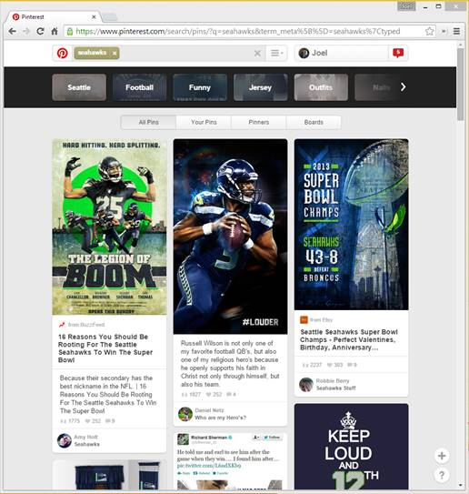
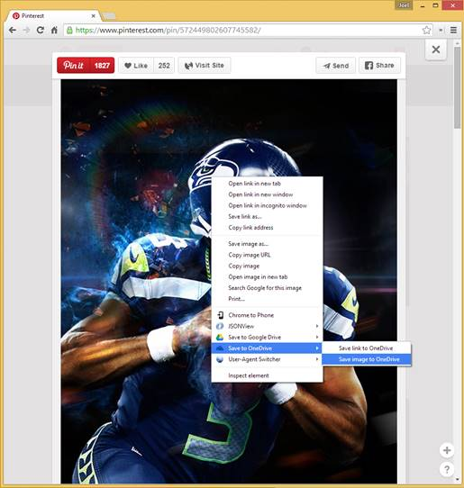
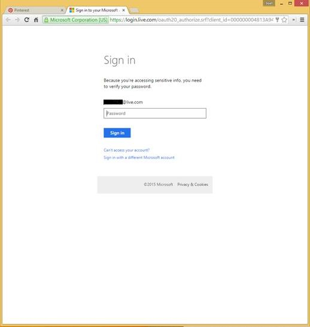
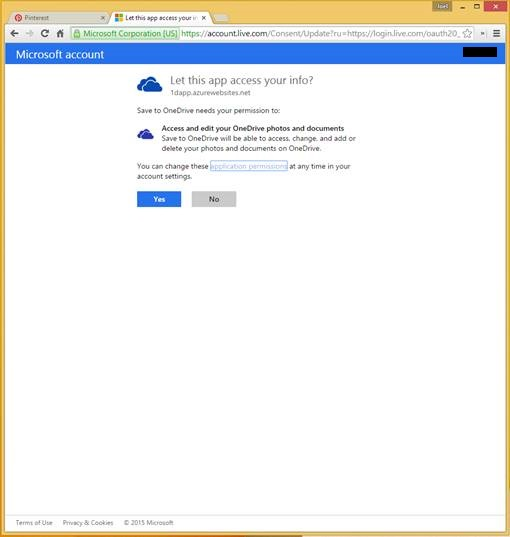

# Save to OneDrive
Save to OneDrive is two things:
* A Chrome extension that allows a Chrome user to find content in his or her browser and save it to his or her OneDrive root easily.
* A HTTP service API that backs the Chrome extension

## Using the Chrome extension 
### Pre-requisites
* A whitelisted OneDrive account
* the Google Chrome extension installed

### How to use it
* Pick a website.   I like https://www.pinterest.com/search/pins/?q=seahawks.

* Find an image.   Right click on the image and click on “Save to OneDrive > Save image to OneDrive”.   Since this is Pinterest, I had to click on the image first to make it bigger.

* Sign in with your MSA.

* Give the app permission to access your OneDrive if you haven’t done so in the past.

* Wait while the app downloads the content to your OneDrive.   Or don’t wait (close your browser) since the process is async.

### How to install the Chrome extension
#### Update your installation
1. Download the extension code to the well known location where you had previously loaded it.
2. Go to chrome://extensions
3. Press Ctrl+R to refresh the extension.

#### First time installation
1. Download the extension code to a well known location.
2. Go to chrome://extensions
3. Check “Developer mode”
4. Click on “Load unpacked extension…”
5. Find the well known location and click "OK".
	

## Using the HTTP service
URL: http://1dapp.azurewebsites.net

<table>
<thead>
<tr>
<th>Query Parameter Name</th>
<th>Value</th>
<th>Description</th>
</tr>
</thead>
<tbody>
<tr>
<td><code>url</code></td>
<td><code>string</code></td>
<td>the URL of the file to be downloaded</td>
</tr>

<tr>
<td><code>appid</code></td>
<td><code>string</code></td>
<td>the Microsoft account <code>Client ID</code> from the <a href="https://account.live.com/developers/applications">MSA developer portal</a></td>
</tr>

<tr>
<td><code>filename</code></td>
<td><code>string</code></td>
<td>the name that the file should be named as</td>
</tr>

</tbody>
</table>
